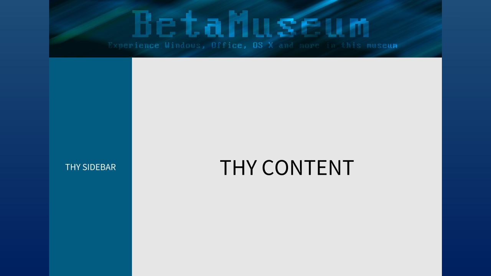
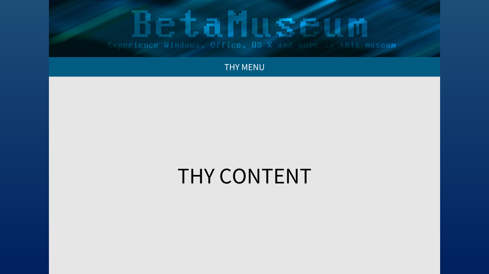
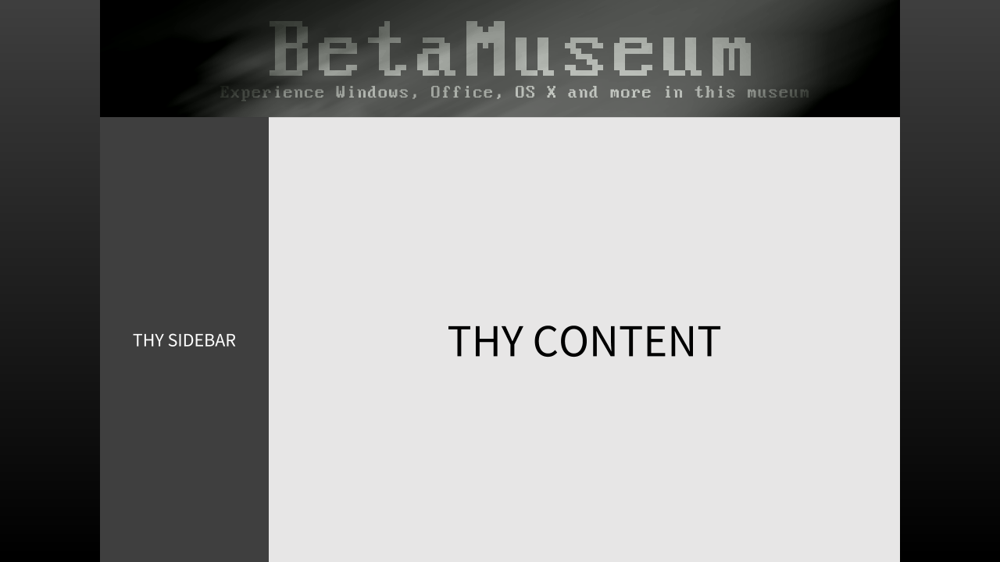
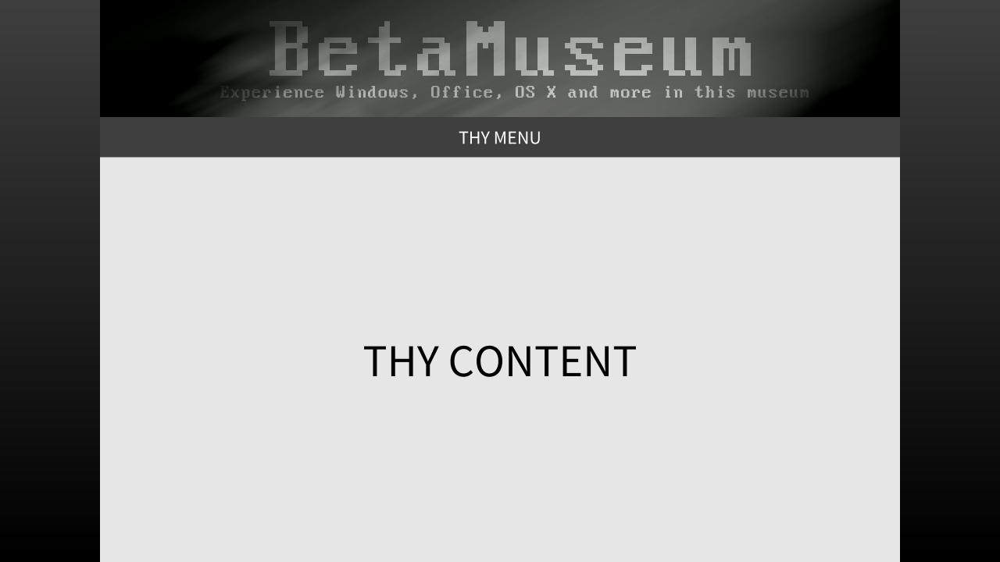
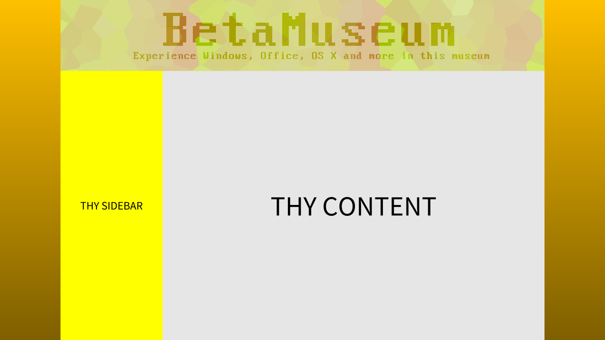
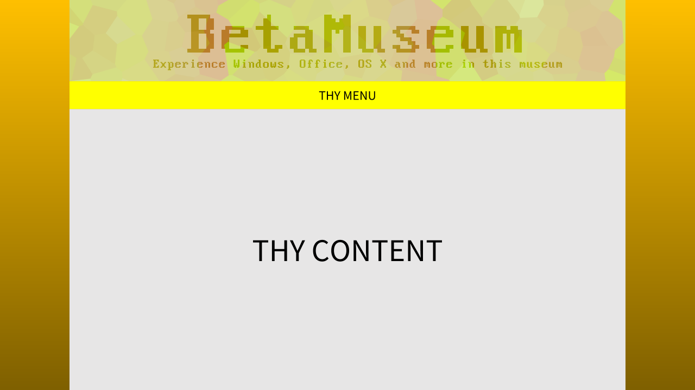
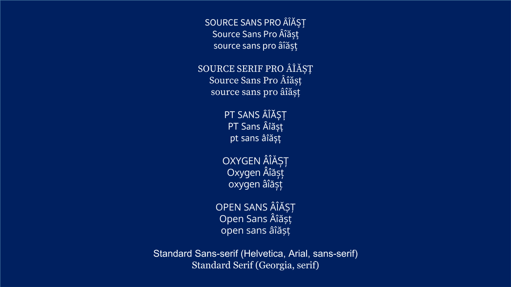
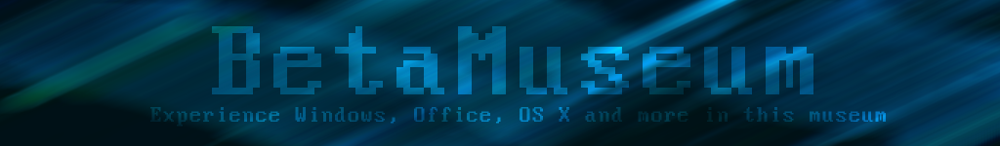

x# Documentation
> This is the recreation of the documentation.
>
> I've made some corrections and changes to better fit the "GitHub README layout."
>
> I have a feeling the documentation is incomplete.
>
> If you want to see the originals files are in the [`originals`](originals) folder.

## Need / Opportunity
The need is to create a website about one or more Windows releases. I am the stakeholder.

## Concept Designs
|        | Sidebar                                         | Topbar                                         |
|--------|-------------------------------------------------|------------------------------------------------|
| Blue   |      |       |
| Black  |    |     |
| Yellow |  |   |

I have asked multiple people and the blue colour scheme with the sidebar design and Open Sans font family were the most popular.

## Log
### 16/03/2015
Created concepts and layouts. Started asking my friends, family and teachers. I
used the two main professional colours, black and blue, and the colour representing
happiness and friendliness, yellow. For the layouts, I used the two common web layouts, the
‘sidebar’ layout and the ‘navbar’ layout. To see the layouts and colours please check the
PowerPoint in the same folder.

### 17/03/2015
Researched two Windows version betas. Windows 95 (codenamed ‘Chicago’)
and Windows Vista (codenamed ‘Longhorn’ before the project reset). I’ve also collected
some locations where you can download the builds legally. WinWorldPC is one of the places.
The downloads would be legal anyway since it is now abandon ware. While Windows Vista
itself is not abandon ware yet, but the pre-release builds like the ones in M3 to M7, O13 to
Release Candidate are abandon ware. I’ve also layed out the folders. It is in a tree format
because it will be easier for people to find the right content and to make it easier for me to
fix things.

### 18/03/2015
Based on the feedback from friends, teachers and family, the blue colour
scheme was the most favoured and there were the same amount of people who chose both
the Sidebar and NavBar design. I have chosen the Sidebar design because it’s the one that I
have the most experience making. Also, some people suggested that I should add an image
or gradient to the background because it was a little bit bland. I’ve added a gradient because
it was easier to create and it uses less resources in the browser. Finally, most people
surveyed liked Open Sans, Made banners for the website. Based on an image of a tree that I
took this summer at the light festival in the botanical gardens. I released it as Public Domain,
so anyone can use it.

| Original Image | BetaMuseum Heading |
|------------|-----|
|  |  |

The picture was cropped to fit 1024×150 (which is the ideal banner size). Then a ‘Zoom Blur’
effect was added to it to make the translucent text over it more readable and to give an
awesome-looking background. After that I’ve written the title of the website and a little
description in white. I set the layer type from ‘Normal’ to ‘Overlay’ set the text is now
translucent. All these modifications were made in a freeware program called ‘[Paint.NET](http://getpaint.net)’. I
was going to put some logos on the banner, but it didn’t look good afterwards so I removed
them.

### 19/03/2015
Started building the template HTML file and the linked Cascading Style Sheet
(CSS) and JavaScript (JS) files. As I was building the CSS, I found a bug which doesn’t allow the
curtain for the sidebar to go down the page completely. The page was continuously opened
in Firefox, SeaMonkey, Chrome, Internet Explorer and Opera on Windows 8.1. The bug was
corrected by using a JavaScript that continuously obtained the page size from the browser
and sets the content and sidebar size respectively. This bug also makes a nice line over the
content. I kept it because it’s not ugly and it doesn’t affect other parts of the page. At the
same time, the content was overflowing out of the box. To fix that, I’ve made the `
`
responsible for the content to be scrollable.

### 20/03/2015
Started building the template HTML file and the linked Cascading Style Sheet
(CSS) and JavaScript (JS) files. As I was building the CSS, I found a bug which doesn’t allow the
curtain for the sidebar to go down the page completely. The page was continuously opened
in Firefox, SeaMonkey, Chrome, Internet Explorer and Opera on Windows 8.1. The bug was
corrected by using a JavaScript that continuously obtained the page size from the browser
and sets the content and sidebar size respectively. This bug also makes a nice line over the
content. I kept it because it’s not ugly and it doesn’t affect other parts of the page. At the
same time, the content was overflowing out of the box. To fix that, I’ve made the &lt;div&gt;
responsible for the content to be scrollable.

### 21/03/2015
Another bug was discovered and patched, but this is when the page’s height is
too small. The content and the sidebar are unreadable. To fix this, the content and sidebar
MUST be larger than 150px. I’ve done this by making a conditional statement that checks the
height variable not to be less than 150 pixels. If the page size is smaller than 150 pixels, the
script restricts it to only being 150 pixels. I’ve also set a style for the `<a>` tags in the sidebar
because they do not look nice if you use the default styling.

### 22/03/2015
Compatibility was checked with a new web browser called Vivaldi.

### 23/03/2015
Compatibility was checked to see if the web page was compatible with Safari,
Chrome, Firefox, Vivaldi, Opera and SeaMonkey on OS X Yosemite, IE on OS X 10.1 and
Chrome, Chromium and Firefox on both Ubuntu and openSUSE.

### 24/03/2015
The sidebar is now finished and thanks to some suggestions, the sidebar labels
have little icons. I chose to continue with this because it increases usability. The logos are
made by myself, but however I’ve made them in such a way that you can kind of recognise
where they’re from. I’ve done this to avoid breaking a copyright laws. I’ve also started writing
the articles while I experiment with the beta build of both Windows Vista and Windows 95.
Written the complete article Windows 95 and up to build 7047 in Windows Vista.

### 25/03/2015
Compatibility was checked with a web browser called Torch.

### 26/03/2015
Started and completed the hub page for Windows.

### 27/03/2015
Started the index page. Most people wanted a static page which describes the
purpose of the website and provides with some information and credits.